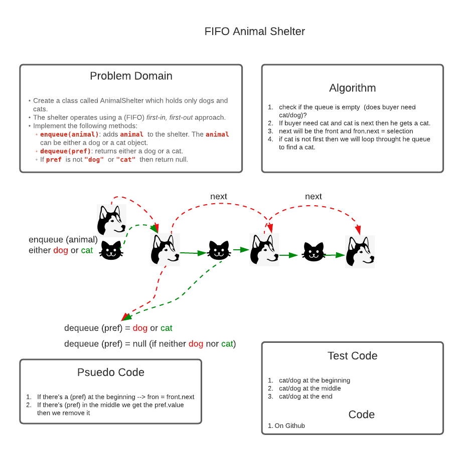

# Code Challenge 12

## Authors: 
Clement Buchanan, Davion Garcia and Kale Lesko

## Challenge Summary
Create a class called AnimalShelter which holds only dogs and cats. The shelter operates using a first-in, first-out approach.

## Challenge Description
Implement the following methods:
  - enqueue(animal): adds animal to the shelter.
  - animal can be either a dog or a cat object.
  - dequeue(pref): returns either a dog or a cat.
  - If pref is not "dog" or "cat" then return null.

## Approach & Efficiency

We used a simple queue and dequeue process vs using an array

## Solution
