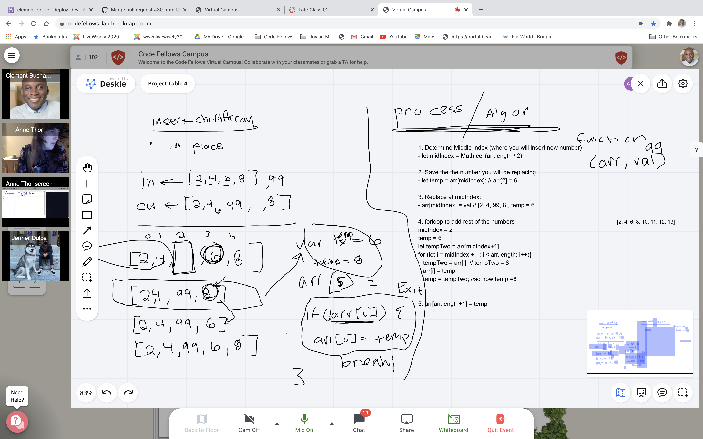

# Challenge Summary
Inserting a number in the middle of and array with even items, odd items or no items in the array.

## Challenge Description
Write a function called insertShiftArray which takes in an array and the value to be added. Without utilizing any of the built-in methods available to your language, return an array with the new value added at the middle index.

## Approach & Efficiency
<!-- What approach did you take? Why? What is the Big O space/time for this approach? -->
- First we determined the middle index then saved the 

## Solution

## Link To The Code

[Click here to be taken to the array-shift.js file to see the code](array-shift.js)