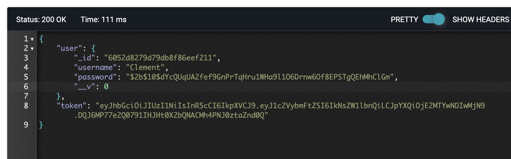
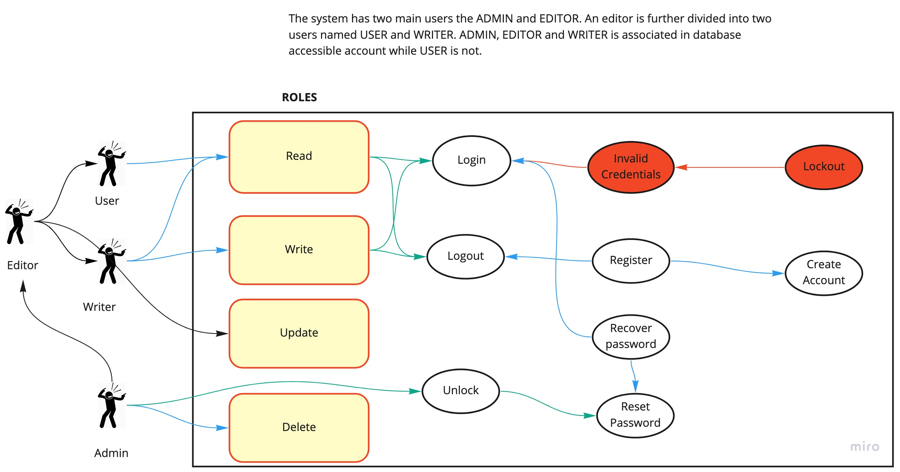

# LAB-07

# Author: Clement Buchanan

- Test Report
- Front End

## Setup

- .env requirements
  - PORT - 8080

# Running the app

- node index.js
- Endpoint: /signup
  - Returns Object
    

## UML

(created with Miro)

Maintain a head and a tail pointer on the merged linked list. 
- I choose the head of the merged linked list by comparing the first node of both linked lists. 
- I choose the smaller current node and link it to the tail of the merged list, and moving the current pointer of that list one step forward.
- I kept doing this while there are some remaining elements in both the lists. If there are still some elements in only one of the lists, I link this remaining list to the tail of the merged list.
- Initially, the merged linked list is NULL
- I made node with the smaller value the head node of the merged linked list. In this case, it is 1 from head 1.
- Since it’s the first and only node in the merged list, it will also be the tail.
- Then I moved head1 one step forward.

## Tests
write test for

- basic authorization middleware test
- bearer authorization midddleware test
