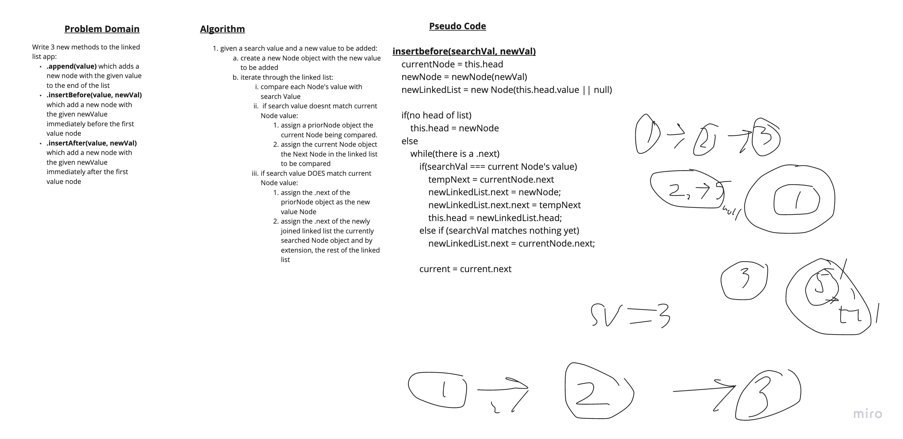

# Challenge Summary
Write methods for a linked list class

## Challenge Description

Write these methods

- .append(value) which adds a new node with the given value to the end of the list
- .insertBefore(value, newVal) which add a new node with the given newValue immediately before the first value node
- .insertAfter(value, newVal) which add a new node with the given newValue immediately after the first value node

## Approach & Efficiency
<!-- What approach did you take? Why? What is the Big O space/time for this approach? -->

## Solution

