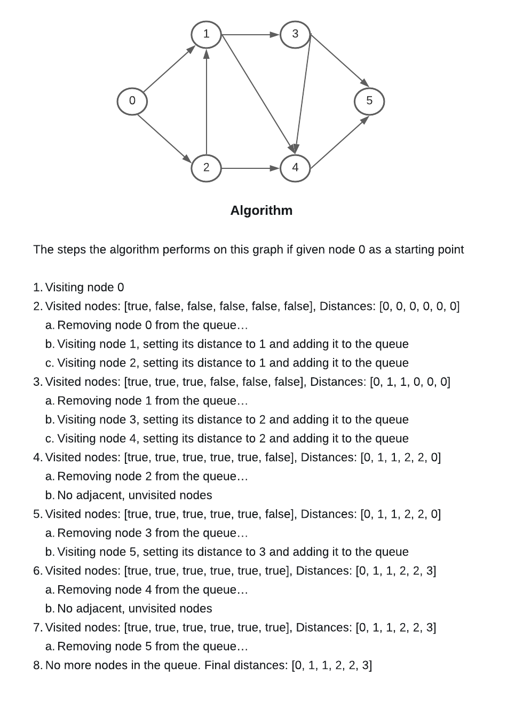

# Graph Implementation

# Authors

Kale Lesko & Clement Buchanan

## Challenge

Implement a graph and represent it as an adjacency list, and should include the following methods:

- add node
- add edge
- get nodes
- get neighbors
- size

## UML

