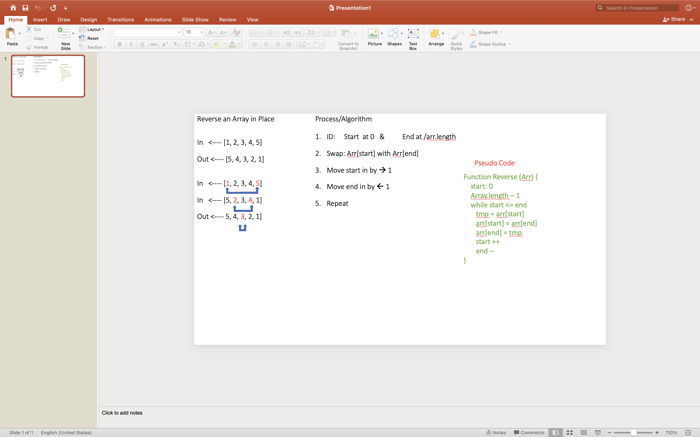

# Reverse an Array
Write a function that reverses an array in place

## Challenge
Be careful of empty arrays or arrays with only one number or odd number count or even number count

## Approach & Efficiency
- Identify the start and end of the array (0 and length -1)
- Swop the arr[start] with the arr[end]
- Move arr[start] forward by --> 1
- Move arr[end] backward by <-- 1
- Repeat while arr[start] <= arr[end]

## Solution

