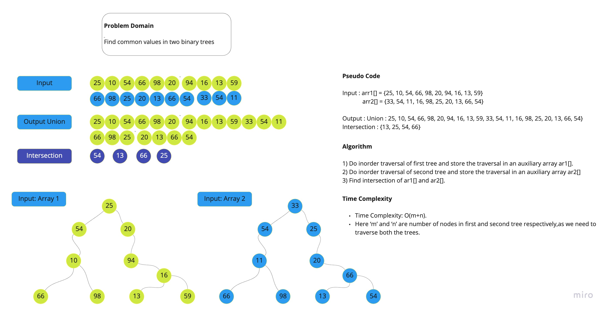

## Challenge Summary
Find the common values in two binary trees

## Authors: Clement Buchanan & Kale Lesko

## Whiteboard Process

## Approach & Efficiency
We know that if we store the inorder traversal of a BST in an array, that array will be sorted in ascending order. So I simply took the inorder traversal of both the trees and store them in two seperate arrays and then find intersection between two arrays.

Time Complexity: O(n+m).
Here ‘m’ and ‘n’ are number of nodes in first and second tree respectively, as we need to traverse both the trees.

## Solution
[Link to code](www.link.com)